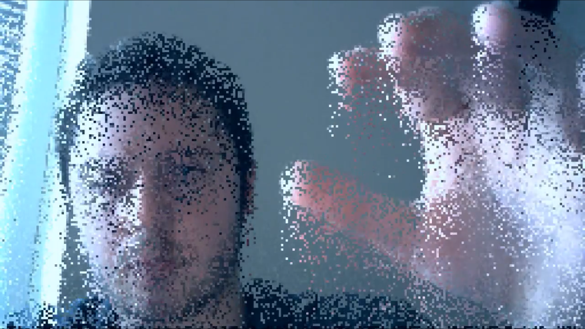

# Pixel_Rain
Glitch art, pixel sorting-esque webcam written in Processing

# About this project

This is a Processing sketch that manipulates a live feed from a webcam. The effect is inspired by pixel sorting. Rather than the pixels being sorted, each pixel has a random chance of being moved down one row each draw loop. This gives the effect of the pixels "raining" down the screen, as each pixel can move only one row at a time rather than having the entire frame sorted at once.

[Here is a video of the sketch in action.](https://www.youtube.com/watch?v=AW5UXmjG1-Q)
[Here is a second video.](https://www.youtube.com/watch?v=Mx-J41CvmEM)
